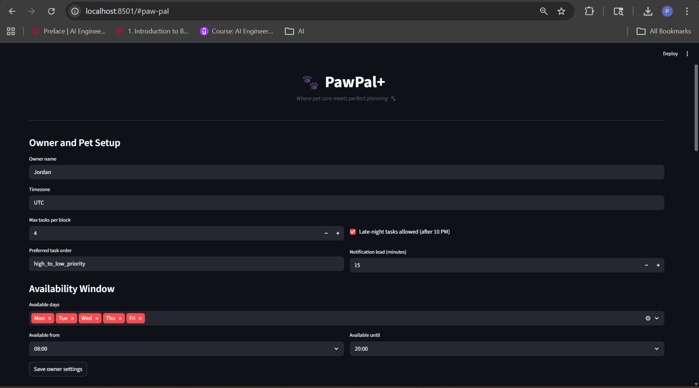
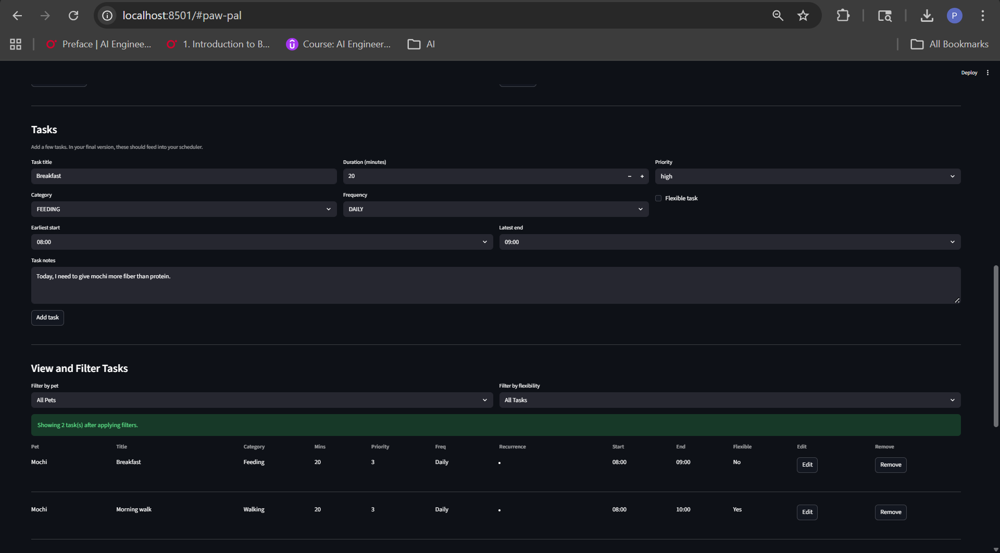

# PawPal+ (Module 2 Project)

You are building **PawPal+**, a Streamlit app that helps a pet owner plan care tasks for their pet.

## Scenario

A busy pet owner needs help staying consistent with pet care. They want an assistant that can:

- Track pet care tasks (walks, feeding, meds, enrichment, grooming, etc.)
- Consider constraints (time available, priority, owner preferences)
- Produce a daily plan and explain why it chose that plan

Your job is to design the system first (UML), then implement the logic in Python, then connect it to the Streamlit UI.

## What you will build

Your final app should:

- Let a user enter basic owner + pet info
- Let a user add/edit tasks (duration + priority at minimum)
- Generate a daily schedule/plan based on constraints and priorities
- Display the plan clearly (and ideally explain the reasoning)
- Include tests for the most important scheduling behaviors

## Demo

PawPal+ provides an intuitive Streamlit interface for managing pet care across multiple pets with intelligent scheduling:

**1. Owner Setup & Pet Management**  


Set owner preferences, configure weekly availability windows, and add/manage multiple pets with detailed profiles.


**2. Task Creation & Management** 


Create tasks with full recurrence patterns (daily, weekly, custom intervals), specify time windows, priority levels, and flexibility. View, filter, and edit tasks in an organized table.


**3. Intelligent Daily Scheduling** 


Generate schedules that respect owner availability and task constraints. View generated tasks marked as complete with timestamps and conflict detection.


**4. Plan Transparency & Explanations** 


Review detailed explanations for every scheduling decision—understand why tasks were placed, deferred, or skipped.

## Features

### Product capabilities

1. **Owner + pet profile management**
	- Create and edit owner profile settings (timezone, preferences, notification lead).
	- Add, edit, and remove pets with species and basic physical details.

2. **Task lifecycle management (CRUD)**
	- Add, edit, and remove care tasks per pet.
	- Capture category, duration, priority, flexibility, time bounds, and notes.

3. **Recurrence-aware planning**
	- Support task frequencies: `DAILY`, `WEEKLY`, and `CUSTOM`.
	- Weekly recurrence uses a target weekday.
	- Custom recurrence supports selected weekdays or every-N-days interval with an anchor date.

4. **Daily schedule generation + explanations**
	- Generate a day plan from all pets/tasks for the selected date.
	- Return schedule explanations describing why tasks were placed, deferred, or skipped.

5. **Interactive schedule execution tracking**
	- Mark scheduled items complete/incomplete from the UI.
	- Completion timestamps are recorded and completion state is preserved across same-day schedule regeneration.

6. **Task visibility and conflict awareness**
	- Filter task views by pet and flexibility.
	- Sort task lists and scheduled items chronologically for stable display.
	- Detect overlapping schedule items and show conflict warnings/suggested fixes.

### Scheduling algorithms implemented

1. **Window-aware greedy placement**
	- Tasks are placed in the earliest feasible non-overlapping slot inside owner availability windows.

2. **Priority + rigidity ordering**
	- Candidate tasks are ordered with non-flexible tasks first, then higher priority, then tighter time bounds.

3. **Backtracking with deferral/removal strategy**
	- If no slot is found, the scheduler first defers lower-priority flexible tasks.
	- If still blocked, it removes lower-priority rigid tasks as a last resort.

4. **Flexible overflow handling**
	- Flexible tasks may be scheduled after their preferred deadline when no pre-deadline gap exists (but still within availability).

5. **Constraint filtering layer**
	- Hard constraints are validated against candidate tasks before placement.
	- Owner preference `avoid_late_night` is enforced during filtering.

6. **Post-processing and observability**
	- `DailySchedule.regenerate()` validates items, removes invalid entries, and adjusts non-locked overlaps.
	- Planning summary and per-task reason codes improve explainability/debuggability.

## Getting started

### Setup

```bash
python -m venv .venv
source .venv/bin/activate  # Windows: .venv\Scripts\activate
pip install -r requirements.txt
```

### Testing PawPal+

command to run: python -m pytest

The test set include:
1. **Task CRUD and completion flow(⭐⭐⭐⭐⭐)** -- These tests verify that tasks are added correctly, completion state is persisted, and completion-related error paths raise expected exceptions. They protect core task lifecycle behavior from create through mark-complete operations.

2. **Core scheduling behavior and ordering(⭐⭐⭐⭐⭐)** -- These tests ensure tasks are actually scheduled within intended time bounds and returned in deterministic chronological order. They validate foundational planner guarantees around timing and stable ordering.

3. **Priority, backtracking, deferral, and flexibility behavior(⭐⭐⭐⭐⭐)** -- These tests cover contention scenarios where the scheduler must prefer high-priority rigid tasks, defer flexible tasks, and allow flexible overflow when needed. They confirm the planner’s conflict-resolution strategy behaves as designed under pressure.

4. **Recurrence rules(⭐⭐⭐⭐⭐)** -- These tests validate daily/weekly/custom recurrence paths, including interval-based rules, weekday-based custom rules, and fallback behavior for partially configured recurrence fields. They ensure tasks appear only on eligible dates and are skipped otherwise.

5. **Availability and constraint filtering(⭐⭐⭐⭐⭐)** -- These tests verify the scheduler respects owner availability, fallback windows, late-night preferences, and hard constraints that filter out invalid tasks. They ensure impossible or policy-violating tasks are excluded before final scheduling.

6. **Schedule regeneration and conflict handling(⭐⭐⭐⭐⭐)** -- These tests confirm regenerate fixes overlaps when allowed, refuses invalid inputs, and preserves locked item positions. They protect post-processing logic that cleans schedules without violating lock semantics.

7. **Explanations and observability(⭐⭐⭐⭐)** -- These tests check that planning outputs include meaningful explanation messages and reason codes, including empty-schedule summaries. They validate that the system remains interpretable and debuggable, not just functionally correct.But sometimes these can be too dependent on exact message phrases, which can be brittle to wording changes.


### Suggested workflow

1. Read the scenario carefully and identify requirements and edge cases.
2. Draft a UML diagram (classes, attributes, methods, relationships).
3. Convert UML into Python class stubs (no logic yet).
4. Implement scheduling logic in small increments.
5. Add tests to verify key behaviors.
6. Connect your logic to the Streamlit UI in `app.py`.
7. Refine UML so it matches what you actually built.
